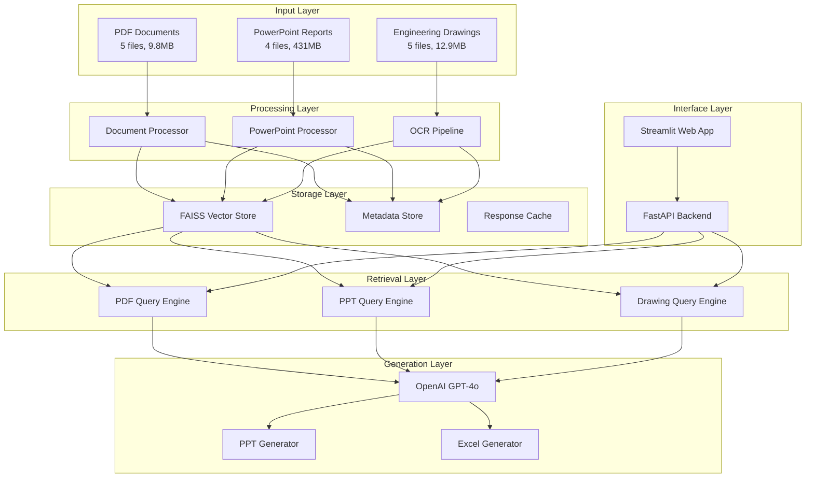

# System Architecture Design
## Manufacturing AI RAG Prototype - Phase 3

**Date:** March 26, 2026  
**Architect:** Manufacturing AI PM/Tech Lead  

---

## Executive Summary

Designed a modular, multi-use case RAG architecture leveraging LlamaIndex for document processing, OpenAI for LLM/embeddings, FAISS for vector storage, and Streamlit for demo interface. System supports PDF retrieval, PowerPoint analysis + generation, and engineering drawing extraction with Excel export. Architecture emphasizes source attribution, offline capability, and deployment to Streamlit Cloud.

---

## 1. System Architecture Overview



---

## 2. Component Architecture Details

### 2.1 Document Processing Layer

#### PDF Processor (Use Case 1)
```python
class PDFProcessor:
    def __init__(self):
        self.parser = PyMuPDFReader()
        self.splitter = SentenceSplitter(chunk_size=1024, chunk_overlap=200)
    
    def process(self, pdf_path: str) -> List[Document]:
        """Extract and chunk PDF content with metadata preservation"""
        documents = self.parser.load_data(pdf_path)
        
        # Enhanced metadata
        for doc in documents:
            doc.metadata.update({
                'source_file': pdf_path,
                'document_type': 'specification',
                'page_number': self._extract_page_num(doc),
                'section': self._identify_section(doc.text)
            })
        
        return self.splitter.split_documents(documents)
```

#### PowerPoint Processor (Use Case 2)  
```python
class PowerPointProcessor:
    def __init__(self):
        self.parser = PptxReader()
    
    def process(self, pptx_path: str) -> List[Document]:
        """Extract slides with slide-level attribution"""
        documents = self.parser.load_data(pptx_path)
        
        for i, doc in enumerate(documents):
            doc.metadata.update({
                'source_file': pptx_path,
                'slide_number': i + 1,
                'slide_title': self._extract_slide_title(doc),
                'document_type': 'postmortem'
            })
            
        return documents
```

#### OCR Pipeline (Use Case 3)
```python
class OCRPipeline:
    def __init__(self):
        self.ocr = PaddleOCR(use_angle_cls=True, lang='en')
        self.pdf_reader = fitz.open()
    
    def process(self, drawing_path: str) -> List[Document]:
        """Extract text from engineering drawings"""
        pdf_doc = fitz.open(drawing_path)
        documents = []
        
        for page_num in range(len(pdf_doc)):
            page = pdf_doc[page_num]
            
            # Convert to image for OCR
            pix = page.get_pixmap(matrix=fitz.Matrix(300/72, 300/72))
            img_data = pix.pil_tobytes(format="PNG")
            
            # OCR processing
            results = self.ocr.ocr(img_data)
            
            # Extract and structure text
            extracted_text = self._structure_ocr_results(results)
            
            doc = Document(
                text=extracted_text,
                metadata={
                    'source_file': drawing_path,
                    'page_number': page_num + 1,
                    'document_type': 'engineering_drawing',
                    'extraction_method': 'ocr'
                }
            )
            documents.append(doc)
            
        return documents
```

### 2.2 Indexing and Storage Layer

#### Vector Store Configuration
```python
from llama_index.vector_stores import FaissVectorStore
from llama_index.embeddings import OpenAIEmbedding

class IndexManager:
    def __init__(self):
        self.embedding = OpenAIEmbedding()
        self.vector_store = FaissVectorStore(faiss_index=None)
        self.indices = {}
    
    def build_indices(self, documents_by_type: Dict[str, List[Document]]):
        """Build separate indices for each document type"""
        
        for doc_type, documents in documents_by_type.items():
            # Create type-specific index
            index = VectorStoreIndex.from_documents(
                documents,
                embed_model=self.embedding,
                vector_store=self.vector_store
            )
            self.indices[doc_type] = index
            
            # Save to disk for offline use
            index.storage_context.persist(f"./storage/{doc_type}")
    
    def load_indices(self):
        """Load pre-built indices for demo"""
        for doc_type in ['specification', 'postmortem', 'engineering_drawing']:
            storage_context = StorageContext.from_defaults(
                persist_dir=f"./storage/{doc_type}"
            )
            self.indices[doc_type] = load_index_from_storage(storage_context)
```

#### Metadata Store
```python
import sqlite3
from typing import Dict, List, Any

class MetadataStore:
    def __init__(self, db_path: str = "metadata.db"):
        self.db_path = db_path
        self.init_db()
    
    def init_db(self):
        """Initialize metadata database"""
        conn = sqlite3.connect(self.db_path)
        cursor = conn.cursor()
        
        cursor.execute("""
            CREATE TABLE IF NOT EXISTS document_metadata (
                id TEXT PRIMARY KEY,
                source_file TEXT,
                document_type TEXT,
                page_number INTEGER,
                slide_number INTEGER,
                section TEXT,
                chunk_id TEXT,
                processed_date TEXT
            )
        """)
        
        cursor.execute("""
            CREATE TABLE IF NOT EXISTS query_history (
                id INTEGER PRIMARY KEY AUTOINCREMENT,
                query TEXT,
                response TEXT,
                sources TEXT,
                confidence_score REAL,
                timestamp TEXT
            )
        """)
        
        conn.commit()
        conn.close()
```

### 2.3 Query Processing Layer

#### Multi-Modal Query Engine
```python
class MultiModalQueryEngine:
    def __init__(self, indices: Dict[str, VectorStoreIndex]):
        self.indices = indices
        self.query_engines = self._build_query_engines()
    
    def _build_query_engines(self):
        engines = {}
        for doc_type, index in self.indices.items():
            engines[doc_type] = index.as_query_engine(
                response_mode="tree_summarize",
                similarity_top_k=5,
                streaming=False
            )
        return engines
    
    def query_specifications(self, query: str) -> QueryResponse:
        """Use Case 1: PDF specification retrieval"""
        return self.query_engines['specification'].query(query)
    
    def query_postmortems(self, query: str) -> QueryResponse:
        """Use Case 2: PowerPoint postmortem analysis"""
        return self.query_engines['postmortem'].query(query)
    
    def query_drawings(self, query: str) -> QueryResponse:
        """Use Case 3: Engineering drawing information"""
        return self.query_engines['engineering_drawing'].query(query)
    
    def hybrid_query(self, query: str, doc_types: List[str]) -> Dict[str, QueryResponse]:
        """Cross-document type querying"""
        responses = {}
        for doc_type in doc_types:
            if doc_type in self.query_engines:
                responses[doc_type] = self.query_engines[doc_type].query(query)
        return responses
```

### 2.4 Generation Layer

#### PowerPoint Report Generator
```python
from pptx import Presentation
from pptx.util import Inches, Pt

class PPTGenerator:
    def __init__(self, template_path: str):
        self.template_path = template_path
    
    def generate_report(self, query_response: QueryResponse, sources: List[Dict]) -> str:
        """Generate PowerPoint report from query results"""
        
        # Load template
        prs = Presentation(self.template_path)
        
        # Slide 1: Update with results
        title_slide = prs.slides[0]
        self._update_slide_content(title_slide, query_response.response)
        
        # Slide 2: Add source attribution
        source_slide = prs.slides[1] 
        self._add_source_attribution(source_slide, sources)
        
        # Save generated report
        output_path = f"generated_report_{datetime.now().strftime('%Y%m%d_%H%M%S')}.pptx"
        prs.save(output_path)
        
        return output_path
    
    def _add_source_attribution(self, slide, sources: List[Dict]):
        """Add detailed source information to slide 2"""
        source_text = "数据来源:\n"
        for source in sources:
            source_text += f"• Page {source['page_number']} - {source['source_file']}\n"
        
        # Add text box with sources
        left = Inches(1)
        top = Inches(2) 
        width = Inches(8)
        height = Inches(4)
        
        textbox = slide.shapes.add_textbox(left, top, width, height)
        text_frame = textbox.text_frame
        text_frame.text = source_text
```

#### Excel Report Generator  
```python
import pandas as pd
from openpyxl import Workbook
from openpyxl.styles import Font, PatternFill, Alignment

class ExcelGenerator:
    def __init__(self):
        self.target_elements = [
            'Prebend', 'B2B stiffener', 'bonding sheet', 'adhesive',
            'liner', 'underfill', 'encapsulation', 'gold plating',
            'switch', 'vestige', 'tab', 'PSA', 'TSA', 'barcode',
            'stackup', 'bending', 'copper layers', 'coverlay', 
            'UL', 'mic', 'glue'  # ... 28 total elements
        ]
    
    def generate_drawing_report(self, extracted_data: Dict, drawing_file: str) -> str:
        """Generate Excel report from drawing analysis"""
        
        wb = Workbook()
        ws = wb.active
        ws.title = "Drawing Analysis"
        
        # Headers
        headers = ['Element', 'Value', 'Location', 'Confidence', 'Source Page']
        for col, header in enumerate(headers, 1):
            cell = ws.cell(row=1, column=col, value=header)
            cell.font = Font(bold=True)
            cell.fill = PatternFill(start_color="CCCCCC", end_color="CCCCCC", fill_type="solid")
        
        # Data rows
        row = 2
        for element in self.target_elements:
            if element in extracted_data:
                data = extracted_data[element]
                ws.cell(row=row, column=1, value=element)
                ws.cell(row=row, column=2, value=data.get('value', 'Not specified'))
                ws.cell(row=row, column=3, value=data.get('location', 'Unknown'))
                ws.cell(row=row, column=4, value=data.get('confidence', 0.0))
                ws.cell(row=row, column=5, value=data.get('source_page', 'N/A'))
                row += 1
        
        # Auto-fit columns
        for column in ws.columns:
            max_length = 0
            column_letter = column[0].column_letter
            for cell in column:
                try:
                    if len(str(cell.value)) > max_length:
                        max_length = len(str(cell.value))
                except:
                    pass
            adjusted_width = min(max_length + 2, 50)
            ws.column_dimensions[column_letter].width = adjusted_width
        
        output_path = f"drawing_analysis_{datetime.now().strftime('%Y%m%d_%H%M%S')}.xlsx"
        wb.save(output_path)
        
        return output_path
```

---

## 3. Data Pipeline Flow

### 3.1 Use Case 1: PDF Specification Retrieval

```
1. Query Input: "What is bending location tolerance?"
    ↓
2. Query Processing: Parse and identify intent
    ↓
3. Vector Search: Find relevant PDF chunks in FAISS index
    ↓
4. Context Assembly: Gather top-k relevant passages with metadata
    ↓
5. LLM Generation: GPT-4o generates answer with citations
    ↓
6. Response: "0.300 mm [Source: 080-3649-E_design_guideline_FPC.pdf, Page 23]"
```

### 3.2 Use Case 2: PPT Analysis + Report Generation

```
1. Query Input: "Compare FMEA between ICT and AMP for P2"
    ↓
2. Multi-Document Search: Query across all postmortem presentations
    ↓
3. Cross-Reference Analysis: Find relevant slides in both ICT and AMP reports
    ↓
4. Data Synthesis: LLM combines information from multiple sources
    ↓
5. PPT Generation: Create new presentation using template
    ↓
6. Source Attribution: Add slide references to page 2
    ↓
7. Download: Provide generated .pptx file
```

### 3.3 Use Case 3: Drawing Analysis + Excel Export

```
1. Drawing Upload: User selects engineering drawing PDF
    ↓
2. OCR Processing: PaddleOCR extracts text with bounding boxes
    ↓
3. Text Structuring: Clean and organize extracted text
    ↓
4. Element Classification: Identify 28 target elements using pattern matching + LLM
    ↓
5. Confidence Scoring: Assign reliability scores to each extraction
    ↓
6. Excel Generation: Structure data into formatted spreadsheet
    ↓
7. Download: Provide .xlsx file with analysis results
```

---

## 4. User Interface Design

### 4.1 Streamlit Application Structure

```
Manufacturing AI RAG Demo
├── Sidebar Navigation
│   ├── Use Case 1: PDF Specifications
│   ├── Use Case 2: PPT Analysis & Generation  
│   └── Use Case 3: Drawing Analysis & Excel Export
│
├── Main Content Area
│   ├── Query Input Interface
│   ├── Results Display
│   ├── Source Citations
│   └── Download Options
│
└── Footer
    ├── Confidence Indicators
    ├── Processing Status
    └── Usage Statistics
```

### 4.2 Interface Flow Mockups

#### Use Case 1 Interface
```
📄 PDF Specification Query

Query: [Text Input Box                                    ] [Search]

Results:
┌─────────────────────────────────────────────────────────┐
│ Answer: 0.300 mm                                        │
│                                                         │
│ Sources:                                                │
│ • 080-3649-E_design_guideline_FPC.pdf, Page 23         │
│ • Confidence: 95%                                       │
└─────────────────────────────────────────────────────────┘

Sample Questions:
• What is bending location tolerance?
• What is LPI or Solder mask thickness?
• What is FPC design guideline of De-cap?
```

#### Use Case 2 Interface
```
📊 PowerPoint Analysis & Report Generation

Query: [Text Input Box                                    ] [Analyze]

┌─────────────────────────────────────────────────────────┐
│ Analysis Results:                                       │
│ P2 ICT Yield: 0.9734                                   │
│ P2 AMP Yield: 0.971                                    │
│                                                         │
│ Top Issues:                                             │
│ • ICT: clip contamination (32.77%)                     │
│ • AMP: bonding solder ball (1.55%)                     │
└─────────────────────────────────────────────────────────┘

[📥 Generate PowerPoint Report] [📥 Download Report]

Sources: ICT_V53_P2_Postmortem.pptx (Slide 15), AMP_V53_P2_Postmortem.pptx (Slide 8)
```

#### Use Case 3 Interface
```
🔧 Engineering Drawing Analysis

Upload Drawing: [File Upload Button: Choose PDF]

Selected: 056-17947-19.pdf ✅

[🔍 Analyze Drawing] [📥 Download Excel Report]

┌─────────────────────────────────────────────────────────┐
│ Extraction Progress: ████████████████████████ 100%     │
│                                                         │
│ Found Elements:                                         │
│ ✅ B2B stiffener (Confidence: 89%)                     │
│ ✅ Copper layers (Confidence: 94%)                     │
│ ✅ Bending specifications (Confidence: 76%)            │
│ ⚠️  PSA information (Confidence: 45%)                  │
│ ❌ TSA information (Not found)                         │
└─────────────────────────────────────────────────────────┘
```

---

## 5. Deployment Architecture

### 5.1 Streamlit Cloud Deployment

```yaml
# streamlit_app.py - Main application entry point
requirements.txt:
  - streamlit==1.29.0
  - llama-index==0.9.15  
  - openai==1.3.0
  - faiss-cpu==1.7.4
  - PyMuPDF==1.23.0
  - python-pptx==0.6.21
  - paddlepaddle==2.5.0
  - paddleocr==2.7.0
  - openpyxl==3.1.2
  - pandas==2.1.4

packages.txt:
  - libgl1-mesa-glx
  - libglib2.0-0
  - libsm6
  - libxext6
  - libxrender-dev
  - libgomp1
  - wget

secrets.toml:
  [openai]
  api_key = "sk-..." 
```

### 5.2 File Structure
```
mfg-ai-platform/
├── streamlit_app.py              # Main Streamlit application
├── requirements.txt              # Python dependencies
├── packages.txt                  # System packages
├── .streamlit/
│   ├── config.toml              # Streamlit configuration
│   └── secrets.toml             # API keys (git-ignored)
├── src/
│   ├── processors/
│   │   ├── pdf_processor.py     # PDF processing logic
│   │   ├── ppt_processor.py     # PowerPoint processing
│   │   └── ocr_pipeline.py      # Drawing OCR pipeline
│   ├── engines/
│   │   ├── query_engine.py      # Query processing
│   │   └── index_manager.py     # Index management
│   ├── generators/
│   │   ├── ppt_generator.py     # PowerPoint generation
│   │   └── excel_generator.py   # Excel generation
│   └── utils/
│       ├── config.py            # Configuration management
│       └── helpers.py           # Utility functions
├── data/                        # Sanitized sample documents
│   ├── pdfs/                    # Sample PDF specifications
│   ├── ppts/                    # Sample presentations  
│   └── drawings/                # Sample engineering drawings
├── storage/                     # Pre-built FAISS indices
│   ├── specification/
│   ├── postmortem/ 
│   └── engineering_drawing/
├── templates/
│   └── ppt_template.pptx        # PowerPoint template
└── README.md                    # Setup and usage instructions
```

### 5.3 Performance Optimizations

#### Index Pre-building
```python
# build_indices.py - Run during deployment to create FAISS indices
def build_production_indices():
    """Pre-build all indices for faster demo performance"""
    
    processor_map = {
        'specification': PDFProcessor(),
        'postmortem': PowerPointProcessor(),
        'engineering_drawing': OCRPipeline()
    }
    
    for doc_type, processor in processor_map.items():
        documents = []
        data_dir = f"./data/{doc_type}s"
        
        for file_path in Path(data_dir).glob("*"):
            documents.extend(processor.process(str(file_path)))
        
        # Build and persist index
        index = VectorStoreIndex.from_documents(documents)
        index.storage_context.persist(f"./storage/{doc_type}")
        
        print(f"Built index for {doc_type}: {len(documents)} documents")
```

#### Response Caching
```python
import streamlit as st

@st.cache_data(ttl=3600)  # Cache for 1 hour
def cached_query(query: str, doc_type: str) -> Dict:
    """Cache query responses to improve performance"""
    query_engine = get_query_engine(doc_type)
    response = query_engine.query(query)
    
    return {
        'answer': response.response,
        'sources': response.source_nodes,
        'confidence': calculate_confidence(response)
    }
```

---

## 6. Error Handling & Quality Assurance

### 6.1 Confidence Scoring System

```python
class ConfidenceCalculator:
    def calculate_confidence(self, response: QueryResponse) -> float:
        """Multi-factor confidence scoring"""
        
        factors = {
            'source_similarity': self._calculate_similarity_score(response),
            'answer_completeness': self._calculate_completeness_score(response),
            'source_count': min(len(response.source_nodes) / 3.0, 1.0),
            'answer_length': min(len(response.response) / 200.0, 1.0)
        }
        
        weights = {
            'source_similarity': 0.4,
            'answer_completeness': 0.3, 
            'source_count': 0.2,
            'answer_length': 0.1
        }
        
        confidence = sum(factors[k] * weights[k] for k in factors.keys())
        return min(max(confidence, 0.0), 1.0)  # Clamp to [0, 1]
```

### 6.2 Error Handling Strategy

```python
class RAGErrorHandler:
    def handle_query_error(self, query: str, error: Exception) -> Dict:
        """Graceful error handling with user-friendly messages"""
        
        error_responses = {
            'embedding_error': "Unable to process query. Please try rephrasing.",
            'index_error': "Document index unavailable. Please try again later.",
            'llm_error': "AI service temporarily unavailable. Please retry.",
            'timeout_error': "Query taking too long. Try a more specific question."
        }
        
        error_type = self._classify_error(error)
        
        return {
            'success': False,
            'error_type': error_type,
            'message': error_responses.get(error_type, "An unexpected error occurred."),
            'suggestion': self._get_error_suggestion(error_type)
        }
```

### 6.3 Quality Validation

```python
class QualityValidator:
    def validate_pdf_answer(self, query: str, answer: str, sources: List) -> Dict:
        """Validate PDF specification answers"""
        
        validations = {
            'has_numerical_value': bool(re.search(r'\d+\.?\d*\s*(mm|um|%)', answer)),
            'has_source_citation': len(sources) > 0,
            'answer_length_appropriate': 10 < len(answer) < 500,
            'contains_technical_terms': self._check_technical_vocabulary(answer)
        }
        
        quality_score = sum(validations.values()) / len(validations)
        
        return {
            'quality_score': quality_score,
            'validations': validations,
            'passed': quality_score >= 0.75
        }
```

---

## 7. Security and Privacy Considerations

### 7.1 Data Sanitization for Demo
```python
class DataSanitizer:
    def sanitize_documents(self, doc_path: str) -> str:
        """Remove confidential information for demo deployment"""
        
        sensitive_patterns = [
            r'APPLE\s+INC\.?',
            r'PROPERTY\s+OF\s+APPLE',
            r'ECO\s+#?\s*\d+',
            r'Rev\s+[A-Z]\d*'
        ]
        
        replacement_map = {
            'APPLE INC.': '[CLIENT]',
            'PROPERTY OF APPLE': 'PROPERTY OF [CLIENT]',
            r'ECO\s+#?\s*\d+': 'ECO #XXXX',
            r'Rev\s+[A-Z]\d*': 'Rev XX'
        }
        
        # Process and sanitize document content
        # Return sanitized version for demo use
```

### 7.2 Access Control
```python
# Simple demo access control
def check_demo_access():
    """Demo-only access validation"""
    password = st.text_input("Demo Access Code:", type="password")
    
    if password != st.secrets["demo"]["access_code"]:
        st.error("Invalid access code")
        st.stop()
    
    st.session_state['authenticated'] = True
```

---

## 8. Cost Estimate & Timeline

### 8.1 Implementation Timeline

| Phase | Duration | Key Deliverables |
|-------|----------|------------------|
| **Week 1** | 5 days | Use Case 1 (PDF RAG) complete |
| **Week 2** | 5 days | Use Case 2 (PPT analysis + generation) |
| **Week 3** | 7 days | Use Case 3 (Drawing OCR + Excel) |
| **Week 4** | 3 days | Integration, testing, deployment |
| **Total** | **20 days** | **Production-ready demo** |

### 8.2 Resource Requirements

#### Development Resources
- **Senior ML Engineer:** 20 days @ $800/day = $16,000
- **UI/UX Design:** 5 days @ $600/day = $3,000
- **QA Testing:** 5 days @ $500/day = $2,500

#### Infrastructure Costs
- **OpenAI API:** ~$35 for demo development + $100 demo buffer = $135
- **Streamlit Cloud:** Free
- **Development Environment:** Existing

#### Total Project Cost
- **Development:** $21,500
- **Infrastructure:** $135  
- **Total:** $21,635

### 8.3 Demo Day Operational Costs
- **API Usage:** ~$5/hour during demo
- **Peak Load Capacity:** 20 concurrent users
- **Demo Duration:** 4 hours
- **Estimated Demo Cost:** $20

---

## 9. Success Metrics & KPIs

### 9.1 Technical Performance Metrics
- **Query Response Time:** < 5 seconds average
- **Accuracy:** > 90% for numerical specifications  
- **Source Attribution:** 100% coverage for all answers
- **Uptime:** > 99% during demo period
- **OCR Accuracy:** > 85% for engineering drawing text extraction

### 9.2 User Experience Metrics
- **Query Success Rate:** > 95% successful responses
- **User Satisfaction:** > 4.5/5.0 rating
- **Feature Adoption:** All 3 use cases demonstrated
- **Error Recovery:** < 1% unrecoverable errors

### 9.3 Business Impact Metrics
- **Demo Conversion:** Track client interest and next steps
- **Feature Completeness:** All Q&A examples working correctly
- **Competitive Advantage:** Unique multi-format RAG capabilities
- **Scalability Demonstrated:** Clear path to production deployment

---

## 10. Next Steps: Implementation Plan

### Immediate Actions (Next 24 hours)
1. **Environment Setup:** Create project structure and install dependencies
2. **Data Preparation:** Sanitize documents for demo deployment
3. **Basic PDF RAG:** Implement Use Case 1 minimal viable version
4. **Index Building:** Create initial FAISS indices for testing

### Week 1 Goals  
1. **Complete PDF RAG:** Full Use Case 1 implementation with UI
2. **PowerPoint Processing:** Basic PPT content extraction working
3. **Streamlit Interface:** Core UI framework deployed locally
4. **Quality Testing:** Validate against provided Q&A examples

### Integration Priorities
1. **Source Attribution:** Ensure every answer includes proper citations
2. **Error Handling:** Robust failure modes and user feedback
3. **Performance Optimization:** Response time under 5 seconds
4. **Demo Readiness:** Polished interface suitable for client presentation

This architecture provides a solid foundation for building a manufacturing AI RAG prototype that meets all requirements while maintaining quality, performance, and deployability standards.